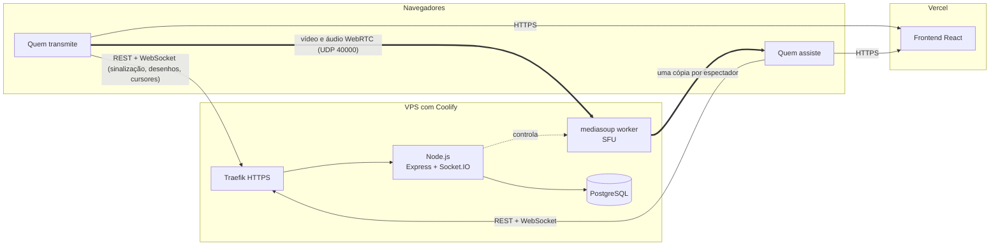

# Screenify

Compartilhamento de tela em tempo real, direto do navegador, com anotações colaborativas por cima da transmissão.

**Demo:** [screenify.jcrldev.com](https://screenify.jcrldev.com)

Crie uma sala, envie o link e compartilhe sua tela. Quem entra assiste em tempo real e pode desenhar, marcar e apontar sobre a tela, com o cursor de cada pessoa visível para todos. Sem instalar nada e sem criar conta.

## Funcionalidades

- **Salas por link**, com código curto (`X7K2-9MPA`) e senha opcional
- **Compartilhamento de tela** em até 1080p a 60 FPS, com a qualidade trocada durante a transmissão sem derrubar ninguém
- **Áudio da aba ou do sistema** junto com a tela (Chrome e Edge, ao compartilhar uma aba ou a tela inteira), em Opus estéreo e sem o processamento de voz que estraga música e jogos; quem assiste pode silenciar
- **Simulcast**: cada espectador recebe a resolução que a conexão dele aguenta (1080p, 720p ou 360p) e pode fixar uma
- **Anotações em tempo real**: lápis, marcador, linha, seta, círculo, retângulo, texto e borracha, com desfazer e refazer; os traços aparecem para os outros enquanto ainda estão sendo desenhados
- **Cursores colaborativos** com nome e cor de cada participante
- **Métricas ao vivo**: resolução, FPS, bitrate, RTT e perda de pacotes, lidas do `getStats()` do WebRTC
- **Reconexão automática** e salas que expiram sozinhas depois de 10 minutos vazias
- **Responsivo**: desktop, tablet e celular (no celular é possível assistir e anotar com o dedo)

## Arquitetura



**Por que um SFU.** Em WebRTC ponto a ponto, quem transmite enviaria uma cópia da tela para cada espectador, e a conexão dele viraria o gargalo a partir de três ou quatro pessoas. Com o mediasoup no meio, quem transmite envia uma vez, e o servidor replica sem decodificar o vídeo (o que seria caro demais para uma VPS de um núcleo).

**Sinalização e mídia separadas.** O WebSocket carrega tudo que é pequeno e precisa ser confiável: entrar na sala, negociar a conexão de mídia, desenhos e cursores. A mídia (vídeo e áudio) vai direto para o mediasoup por UDP, numa única porta (`WebRtcServer`), com TCP na mesma porta como plano B para redes que bloqueiam UDP.

**Coordenadas normalizadas.** Desenhos e cursores trafegam como pontos de 0 a 1 relativos à imagem da tela, não aos pixels de quem desenha. Um círculo feito sobre a tela em 1080p cai no mesmo lugar para quem assiste em 360p numa janela pequena.

## Stack

| Camada | Tecnologias |
|---|---|
| Frontend | React 19, TypeScript, Vite, Tailwind CSS 4, React Router, Zustand, mediasoup-client, Socket.IO client |
| Backend | Node.js 22, Express 5, Socket.IO, mediasoup, Prisma 7, PostgreSQL 17, Zod, Pino |
| Testes | Vitest e Supertest, contra um banco e servidores reais, sem mocks de banco |
| Infraestrutura | Docker (build multi-stage), Coolify na VPS, Vercel para o frontend |

O repositório é um monorepo com npm workspaces: `frontend/`, `backend/` e `shared/` (os tipos do contrato entre os dois, incluindo os eventos do WebSocket tipados ponta a ponta).

## Decisões que valem destacar

- **Estado quente em memória, histórico no banco.** Presença, mídia, desenhos e cursores vivem em memória; o Postgres guarda salas, sessões e o histórico de participação. A expiração das salas usa um campo no banco como cronômetro, então sobrevive a reinícios e deploys.
- **O servidor nunca confia no cliente.** Todo payload passa pelo Zod; o autor de cada traço e o dono de cada recurso de mídia são definidos pelo servidor; limites de ritmo, de tamanho e de conexões por IP em todas as entradas.
- **Qualidade real, não a pedida.** O navegador pode entregar menos do que o solicitado (e muitas vezes entrega); a interface mostra sempre o que está sendo capturado e recebido de fato.
- **Envio em lotes para os desenhos, descarte para os cursores.** Pontos de um traço nunca podem se perder, então são agrupados a cada 50 ms; posições de cursor só importam enquanto são as mais recentes, então as antigas são descartadas.

## Rodando localmente

Pré-requisitos: Node.js 22, Docker e npm 11.

```bash
git clone https://github.com/Julio-Lopes/screenify.git
cd screenify
npm install
docker compose up -d                      # Postgres
cp backend/.env.example backend/.env
cp frontend/.env.example frontend/.env
npm run prisma:migrate -w @screenify/backend
npm run dev:backend                       # http://localhost:3000
npm run dev:frontend                      # http://localhost:5173
```

Abra `http://localhost:5173` em duas janelas (uma normal e uma anônima) para simular duas pessoas.

Para rodar o backend exatamente como em produção, dentro do Docker:

```bash
docker compose --profile full up -d --build
```

## Testes

```bash
npm run typecheck
npm test
```

O backend roda contra um banco `screenify_test` separado, com o servidor HTTP, o Socket.IO e um worker do mediasoup reais: os testes criam salas, transmitem, desenham e verificam o que chega do outro lado.

## Deploy

| Parte | Onde | Arquivo |
|---|---|---|
| Backend + Postgres | Coolify, build pack Docker Compose | `docker-compose.prod.yml`, `backend/Dockerfile` |
| Frontend | Vercel, Root Directory `frontend` | `frontend/vercel.json` |

O backend precisa da porta **40000 em UDP e TCP** liberada no firewall da VPS e da variável `MEDIASOUP_ANNOUNCED_IP` com o IP público: a mídia não passa pelo proxy HTTP.

## Próximos passos

- Servidor TURN para redes que bloqueiam UDP e também a porta 40000 em TCP
- Mais de um worker do mediasoup (e salas distribuídas entre eles) numa VPS com mais núcleos
- Chat de texto na sala

## Autor

Julio Cesar Ribeiro Lopes · [GitHub](https://github.com/Julio-Lopes) · [LinkedIn](https://www.linkedin.com/in/julio-cesar-ribeiro-lopes)